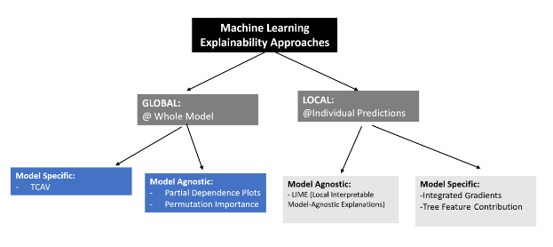

# master-ml-explainability
Master explainability for ML-based algorithms

## ✅ Setup Env
- Create Python environment\
`conda create -n env_name python=3.10`\
`conda activate env_name`
- Create Python environment\
`pip install -r .\path_to_requirements\requirements.txt`

## ✅ The explainability of an algorithm
- Trategies:
  - A global explainability strategy: Provide the details of the formulation of a model as a whole.
  - A local explainability strategy: Provide the rationale for one or more individual predictions made by our trained model.

- Practical use-case with LIME (Local Interpretable Model-Agnostic Explanations)
- 